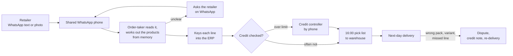
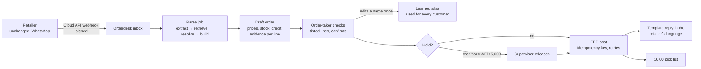

# Process map: the order desk before and after

*Fictional engagement. Times and volumes marked **(brief)** come from the discovery memo and are not measurements.*

## Today

| Step | Who | Time (brief) | What goes wrong |
|---|---|---|---|
| Read the message | Order-taker | — | Slang, Arabizi, photos; "same as last week" means looking up last week |
| Work out SKUs | Order-taker | most of the 6–10 min per order | Pack size and variant guessed from memory |
| Clarify | Order-taker ↔ retailer | minutes to hours | Order waits; peak backlog grows |
| Key into ERP | Order-taker | line by line | Typos; carton vs piece |
| Credit check | Order-taker, then credit controller | often skipped | Orders shipped to customers over their limit |
| Cut-off | Warehouse | 16:00 | Late orders roll to the day after |

## With Orderdesk (v1: a person confirms every order)

| Step | Who | What changes |
|---|---|---|
| Read and match | Orderdesk | The draft is ready in seconds (Sonnet p50 7.4 s on the eval). Every line shows the words it came from and why that product won |
| Check | Order-taker | Reads the tinted lines (low confidence, unusual quantity, out of stock, unit guessed); the rest are there to glance at. Keyboard: j/k between orders, arrows between lines, e to edit, Enter to confirm |
| Fix | Order-taker | One click on another candidate the parser considered, or search by English name, Arabic name or barcode. "Teach this name" turns a correction into an alias |
| Credit | System | Holds are computed, not remembered. Only a supervisor can confirm a held order |
| Post | System | One post per order, idempotent. ERP outages retry with backoff, then show up on the Jobs page |
| Reply | System | A confirmation template in the retailer's language style. No free-form AI text to customers |

## Who touches what

| Role | Today | With Orderdesk |
|---|---|---|
| Retailer | WhatsApp | WhatsApp, unchanged. Gets a confirmation in their language |
| Order-taker | Reads, guesses, keys | Checks, fixes, confirms; teaches names |
| Supervisor / credit controller | Phone calls about limits | Confirms held and high-value orders in the same console |
| IT | ERP admin | Watches the Jobs page and the health check; no new servers to babysit beyond one container and Postgres |
| Salesmen | Relay orders by phone | No change in v1 |

## What stays manual on purpose

- **Confirming every order.** This changes only by the rollout plan's gates ([rollout-plan.md](rollout-plan.md)).
- **Substitutions.** Out-of-stock lines suggest substitutes; a person picks one.
- **Anything that isn't an order.** Complaints, invoice questions and delivery problems are flagged "not an order" and left to a person.
